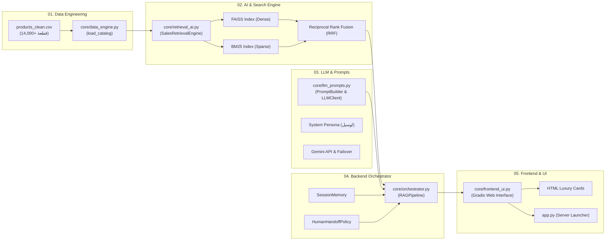

# 🚗 Lucile Sport — AI Auto Parts Sales Chatbot & Hybrid RAG Engine
> **لوسيل سبورت لقطع غيار السيارات في مصر** — مساعد المبيعات الذكي المدعوم بالذكاء الاصطناعي والبحث الهجين (Hybrid RAG).

[](https://www.python.org/)
[](https://gradio.app/)
[](https://github.com/facebookresearch/faiss)
[](LICENSE)

---

## 🌟 نظرة عامة (Overview)

**Lucile Sport (لوسيل سبورت)** هو مساعد مبيعات ذكي مبني خصيصاً لسوق قطع غيار السيارات في مصر. يجمع النظام بين قدرات النماذج اللغوية الكبيرة (**Google Gemini & OpenRouter**) ومحرك بحث هجين فائق السرعة (**Hybrid RAG: FAISS + BM25**) مفهرس عليه أكثر من **14,000+ قطعة غيار سيارات أصلية** مع دعم اللهجة المصرية، حساب خطط وأنظمة التقسيط، وتقديم كروت منتجات تفاعلية فاخرة.

---

## 🏛️ المخطط المعماري وتدفق العمل (System Architecture)



---

## 👥 توزيع العمل والهيكلة على 5 مهندسين (5-Engineer Roles)

تم تقسيم وترتيب الكود بدقة بالترتيب التسلسلي من 1 إلى 5 ليكون واضحاً لكل مهندس عند استعراضه وشرحه:

| # | الدور الهندسي | المهندس المسؤول | الملف المخصص | الاختصاص وما يتم شرحه |
|---|---|---|---|---|
| **1** | **Data Engineer** | مهندس البيانات | [`core/data_engine.py`](core/data_engine.py)<br>[`data/products_clean.csv`](data/products_clean.csv) | تنظيف البيانات، معالجة القيم المفقودة، توحيد الأسعار والخصومات، وتجهيز الكتالوج. |
| **2** | **AI & Search Retrieval** | مهندس البحث والذكاء الاصطناعي | [`core/retrieval_ai.py`](core/retrieval_ai.py)<br>[`database/`](database/) | محرك البحث الهجين (FAISS + BM25)، خوارزمية الدمج RRF، وقاموس الترادف واللهجة المصرية. |
| **3** | **LLM & Prompt Engineer** | مهندس النماذج اللغوية والأوامر | [`core/llm_prompts.py`](core/llm_prompts.py) | هندسة البرومبت، شخصية "لوسيل"، منع الهلوسة، وآلية Fallback التلقائية للنماذج. |
| **4** | **Backend & Orchestrator** | مهندس الباك إند والربط | [`core/orchestrator.py`](core/orchestrator.py)<br>[`core/config.py`](core/config.py) | تنسيق تدفق الـ RAG، إدارة الجلسات، ذاكرة المحادثة، وسياسة التحويل البشري للدعم الفني. |
| **5** | **Frontend & UI Engineer** | مهندس الواجهة وتجربة المستخدم | [`core/frontend_ui.py`](core/frontend_ui.py)<br>[`app.py`](app.py)<br>[`assets/`](assets/) | بناء واجهة Gradio، ثيم Dark Luxury Navy Glassmorphism، وكروت المنتجات التفاعلية. |

> 📘 **للاطلاع على دليل المذاكرة التفصيلي وأسئلة المناقشة لكل دور، راجع: [`TEAM_ROLES_GUIDE.md`](TEAM_ROLES_GUIDE.md)**

---

## 📂 هيكل ملفات المشروع (Repository Layout)

```text
Lucile-Sport-AutoParts/
│
├── app.py                     # نقطة تشغيل التطبيق (Entry Point)
├── requirements.txt           # مكتبات المشروع والاعتماديات
├── README.md                  # التوثيق الشامل
├── TEAM_ROLES_GUIDE.md        # دليل الـ 5 مهندسين الشامل للمناقشة
├── .env.example               # نموذج ملف مفاتيح الـ API
├── .gitignore                 # استبعاد الملفات السرية والمؤقتة
│
├── assets/                    # الشعار وبانر المتجر
│   ├── banner.png             # البانر الرئيسي للمتجر
│   └── logo_dark.jpg          # شعار لوسيل سبورت الداكن
│
├── core/                      # الموديولات الهندسية الخمسة المرتبة
│   ├── __init__.py            # التصديرات النظيفة
│   ├── config.py              # إعدادات النظام والثوابت ومسارات البيانات
│   ├── data_engine.py         # 1️⃣ Role 1: Data Engineer
│   ├── retrieval_ai.py        # 2️⃣ Role 2: AI & Search Retrieval Engineer
│   ├── llm_prompts.py         # 3️⃣ Role 3: LLM & Prompt Engineer
│   ├── orchestrator.py        # 4️⃣ Role 4: Backend & Orchestration Engineer
│   └── frontend_ui.py         # 5️⃣ Role 5: Frontend & UI Engineer
│
├── data/                      # مجموعة البيانات
│   └── products_clean.csv     # كتالوج أكثر من 14,170 قطعة غيار سيارات أصلية
│
└── database/                  # الفهارس الجاهزة
    ├── faiss.index            # الفهرس الشعاعي (Dense Embeddings)
    └── bm25_index.pkl         # الفهرس المعجمي (Sparse BM25)
```

---

## ⚙️ طريقة التثبيت والتشغيل السريع (Quickstart)

### 1. استنساخ المستودع (Clone Repository)
```bash
git clone https://github.com/YOUR_USERNAME/Lucile-Sport-AutoParts.git
cd Lucile-Sport-AutoParts
```

### 2. تثبيت المكتبات (Install Requirements)
```bash
pip install -r requirements.txt
```

### 3. إعداد مفتاح الـ API (API Keys)
قم بنسخ ملف `.env.example` إلى `.env` وضع مفتاح Gemini أو OpenRouter:
```bash
cp .env.example .env
```
محتوى ملف `.env`:
```env
GEMINI_API_KEY=your_gemini_api_key_here
# أو
OPEN_ROUTER_KEY=your_openrouter_api_key_here
```

### 4. تشغيل التطبيق (Run Application)
```bash
python app.py
```

افتح المتصفح على: **`http://localhost:7860`** 🚗✨

---

## 🛠️ التقنيات المستخدمة (Tech Stack)

- **Programming Language**: Python 3.10+
- **Frontend Framework**: Gradio 6.0 + Custom Glassmorphism CSS
- **Vector Search Engine**: FAISS (Facebook AI Similarity Search)
- **Lexical Search**: Rank-BM25 (Okapi)
- **Embeddings**: Sentence-Transformers (`all-MiniLM-L6-v2`)
- **LLM Providers**: Google Gemini API & OpenRouter (Meta-Llama 3.3)
- **Data Engineering**: Pandas & NumPy

---

## 📄 License
This project is licensed under the MIT License - see the [LICENSE](LICENSE) file for details.
