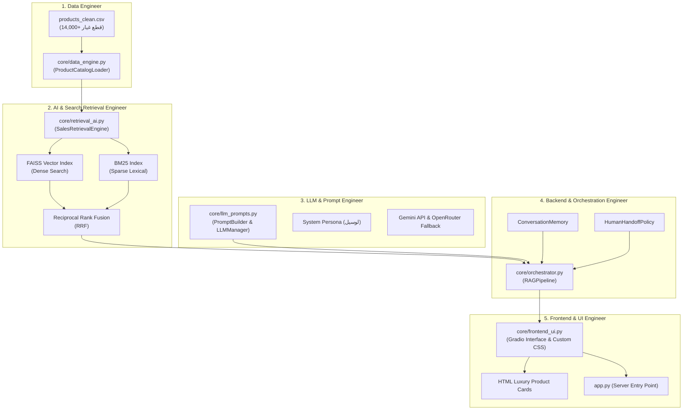

# 🚗 دليل تقسيم وتوزيع أدوار الفريق — مشروع Lucile Sport AI Chatbot

هذا الدليل يوضح توزيع العمل والمسؤوليات الهندسية لمشروع **Lucile Sport** على **5 أعضاء في الفريق**. تم تنظيم الكود وتقليص الملفات ليحتوي كل دور على ملفه المباشر الواضح للدراسة والتطوير والعرض التقديمي (Presentation).

---

## 🏛️ المخطط المعماري العام وتدفق البيانات (System Architecture)



---

# 👥 جدول المهام السريع وتوزيع الملفات على الـ 5 مهندسين

| # | التخصص / الدور | المهندس المسؤول | الملفات المخصصة | الكلاسات والوظائف الأساسية |
|---|---|---|---|---|
| **1** | **Data Engineer** | مهندس البيانات | `core/data_engine.py`<br>`data/products_clean.csv` | `ProductCatalogLoader`<br>`load_products_from_csv()`<br>`get_catalog_stats()` |
| **2** | **AI & Search Retrieval Engineer** | مهندس البحث والذكاء الاصطناعي | `core/retrieval_ai.py`<br>`database/faiss.index`<br>`database/bm25_index.pkl` | `SalesRetrievalEngine`<br>`ARABIC_SYNONYM_MAP`<br>`hybrid_search()`<br>`get_recommendations()` |
| **3** | **LLM & Prompt Engineer** | مهندس النماذج اللغوية والأوامر | `core/llm_prompts.py` | `PromptBuilder`<br>`LLMManager`<br>`_call_gemini()`<br>`SYSTEM_PROMPT` |
| **4** | **Backend & Orchestration Engineer** | مهندس الباك إند والربط | `core/orchestrator.py`<br>`core/config.py` | `RAGPipeline`<br>`ConversationMemory`<br>`HumanHandoffPolicy`<br>`process_message()` |
| **5** | **Frontend & UI Engineer** | مهندس الواجهة وتجربة المستخدم | `core/frontend_ui.py`<br>`app.py`<br>`assets/` | `create_app()`<br>`_render_product_cards()`<br>`CUSTOM_CSS`<br>`respond()` |

---

# 📘 الدليل التفصيلي لكل مهندس (ماذا تذاكر وكيف تشرح دورك)

---

## 1️⃣ مهندس البيانات (Data Engineer)

### 🎯 الوصف والمسؤولية:
مسؤول عن خط أنابيب البيانات (Data Pipeline)، فحص جودة الداتا، تنظيف النصوص والأرقام، التعامل مع القيم المفقودة، وتجهيز كتالوج قطع الغيار ليكون مهيأً لعمليات الفهرسة والبحث.

### 📂 الملفات المخصصة لك:
- `core/data_engine.py`
- `data/products_clean.csv` (أكثر من 14,000 قطعة غيار سيارات)

### 🔑 أهم الدوال والكلاسات التي تشرحها:
1. **`ProductCatalogLoader`**:
   - `_find_csv_path()`: البحث التلقائي عن مسار ملف الكتالوج والتأكد من وجوده.
   - `load_and_clean()`:
     - فلترة المنتجات النشطة فقط (`is_active == 1`).
     - تطهير الأعمدة النصية (`TEXT_COLUMNS`) واستبدال القيم المفقودة بنصوص فارغة.
     - معالجة وتحويل الأعمدة الرقمية (`NUMERIC_COLUMNS`) مثل `final_price`, `initial_price`, `rating`, `discount` وتحويل غير الصالح إلى `0.0`.
     - توليد وضمان فرادة معرف المنتج `product_id`.
   - `get_catalog_stats()`: إحصائيات سريعة عن عدد السجلات والأقسام ومتوسط الأسعار.

### 💡 أسئلة المناقشة المتوقعة وإجاباتها:
- **س: كيف تتعامل مع تباين البيانات أو القيم المفقودة (NaN) في الأسعار؟**
  - **ج:** نستخدم `pd.to_numeric(df[col], errors='coerce').fillna(0.0)` لضمان عدم حدوث Crash عند الحسابات الرياضية وأن كل رقم يمثل قيمة عشرية صالحة.
- **س: ما حجم البيانات التي يتعامل معها النظام؟**
  - **ج:** أكثر من 14,170 قطعة غيار سيارات أصلية تغطي مختلف الماركات المصرية (كيا، هيونداي، تويوتا، نيسان، شيفورليه، فيات، إلخ).

---

## 2️⃣ مهندس البحث والذكاء الاصطناعي (AI & Search Retrieval Engineer)

### 🎯 الوصف والمسؤولية:
مسؤول عن عقل البحث في النظام: محرك البحث الهجين (Hybrid RAG)، الفهرسة الدلالية الشعاعية (FAISS)، الفهرسة المعجمية (BM25)، معالجة اللهجة المصرية ومترادفات قطع الغيار، خوارزمية التوصية بالبدائل، وحسابات التقسيط.

### 📂 الملفات المخصصة لك:
- `core/retrieval_ai.py`
- `database/faiss.index`
- `database/bm25_index.pkl`

### 🔑 أهم المفاهيم والكلاسات التي تشرحها:
1. **`ARABIC_SYNONYM_MAP`**:
   - قاموس ترادف للهجة المصرية للسيارات (مثل: `اسبورتاج` = `سبورتاج` = `Sportage` = `كيا`، `تيل` = `فرامل` = `طنابير`).
2. **`SalesRetrievalEngine`**:
   - `_normalize()`: إزالة التشكيل، التطويل، توحيد الألفات والياء والتاء المربوطة.
   - `_tokenize()` و `_expand_query_text()`: تقطيع النص وتوسيعه بالمترادفات ونزع "الـ" التعريفية.
   - `build_indexes()`:
     - توليد متجهات التضمين بنموذج `all-MiniLM-L6-v2`.
     - بناء فهرس FAISS `IndexFlatL2` وحفظه في القرص.
     - بناء فهرس الكلمات المفتاحية `BM25Okapi` وحفظه بـ pickle.
   - `hybrid_search()`:
     - تنفيذ البحث الكثيف (Dense) + البحث الخفيف (Sparse).
     - دمج النتائج باستخدام تقنية **Reciprocal Rank Fusion (RRF)**:
       $$\text{RRF Score}(d) = \sum_{m \in M} \frac{1}{k + r_m(d)} \quad (k=60)$$
   - `get_recommendations()`: التوصية بمنتجات في نفس النطاق السعري ($70\% - 130\%$) ذات أعلى تقييم.
   - `calculate_installment()`: تطبيق نسب التقسيط الرسمية (0% لـ 3 شهور، 5% لـ 6 شهور، إلخ).

### 💡 أسئلة المناقشة المتوقعة وإجاباتها:
- **س: لماذا استخدمنا البحث الهجين (Hybrid RAG) بدلاً من البحث المتجهي فقط؟**
  - **ج:** لأن أرقام القطع ورموز SKU وموديلات السيارات تحتاج تطابقاً حرفياً دقيقاً (BM25)، بينما وصف المشاكل واستفسارات العملاء العامة تحتاج فهماً دلالياً (FAISS)، والدمج عبر RRF يعطي أعلى دقة استرجاع.

---

## 3️⃣ مهندس النماذج اللغوية وهندسة الأوامر (LLM & Prompt Engineer)

### 🎯 الوصف والمسؤولية:
مسؤول عن موجه النظام وهندسة الأوامر (Prompt Engineering)، صياغة شخصية البوت "لوسيل"، منع الهلوسة وحصر الإجابة بالبيانات، وتأمين الاتصال بنماذج الذكاء الاصطناعي مع التبديل التلقائي عند الأعطال (Multi-Model Fallback).

### 📂 الملفات المخصصة لك:
- `core/llm_prompts.py`

### 🔑 أهم المفاهيم والكلاسات التي تشرحها:
1. **`PromptBuilder`**:
   - `SYSTEM_PROMPT`: تعليمات شخصية "لوسيل" كمستشارة مبيعات مصرية خبيرة ومحترفة، وقواعد صارمة بعدم اختراع أي أسعار أو منتجات غير موجودة في السياق، مع التحدث بنفس لغة العميل.
   - `build_prompt()`: تجميع السياق الديناميكي متضمناً (المنتجات المسترجعة، الأقسام، شروط التقسيط، سجل آخر 5 رسائل، والتعليمات الصارمة).
2. **`LLMManager`**:
   - إدارة نماذج Google Gemini (`gemini-3.1-flash-lite`, `gemma-4-31b-it`, `gemini-3.5-flash`, `gemini-flash-latest`) عبر REST API.
   - دعم نماذج OpenRouter (`meta-llama/llama-3.3-70b-instruct:free`).
   - **Failover & Fallback Mechanism**: إذا فشل أحد النماذج أو نفد الـ Quota، يتحول تلقائياً للنموذج البديل دون انقطاع الخدمة عن المستخدم.
   - `clean_lines`: تنظيف نصوص ومخرجات التفكير الداخلي (`<think>`, `Thought:`, `Reasoning:`) لضمان خروج رد بيعي نقي للعميل.

### 💡 أسئلة المناقشة المتوقعة وإجاباتها:
- **س: كيف تمنعون الهلوسة (Hallucinations) في الأسعار والمنتجات؟**
  - **ج:** عبر Grounded Prompting بحقن بيانات المنتجات المسترجعة فقط من الـ RAG، وإلزام الـ LLM في موجه النظام بعدم ذكر أي رقم أو سعر غير مدعوم في السياق المعطى.

---

## 4️⃣ مهندس الباك إند والربط والتدفق (Backend & Orchestration Engineer)

### 🎯 الوصف والمسؤولية:
مسؤول عن حلقة الوصل المركزية (Orchestration): ربط وتنسيق دورة حياة الطلب بالكامل من لحظة كتابة العميل للرسالة حتى صدور الرد، إدارة الجلسات، ذاكرة المحادثة، سياسات التحويل البشري للدعم الفني، وفلترة المنتجات المستعرضة.

### 📂 الملفات المخصصة لك:
- `core/orchestrator.py`
- `core/config.py`

### 🔑 أهم المفاهيم والكلاسات التي تشرحها:
1. **`ConversationMemory`**:
   - إدارة الجلسات المتعددة مع آلية الإخلاء التلقائي (LRU Eviction) عند تجاوز الحد الأقصى للجلسات (100 جلسة).
   - تخزين سجل المحادثة وقائمة المنتجات التي عاينها العميل (`viewed_products`) لحساب التقسيط عليها لاحقاً.
2. **`HumanHandoffPolicy`**:
   - اكتشاف رغبة العميل في التحدث مع موظف بشري أو فني صيانة عبر الكلمات المفتاحية والأزرار.
3. **`RAGPipeline`**:
   - `process_message()`: الدالة المركزية التي تستقبل الرسالة، تتحقق من التحويل البشري، تستدعي محرك البحث، تبني البرومبت، تستدعي الـ LLM، وتستخرج المنتجات المذكورة.
   - `_filter_surfaced_products()`: فحص نص رد الذكاء الاصطناعي واستخراج المنتجات التي ذكرها بالاسم فقط لعرض كروتها في الواجهة دون إغراق الشاشة بمنتجات لم تُذكر.
   - `_generate_handoff_summary()`: توليد ملخص تقني فوري لمهندس الصيانة يتضمن المشكلة والموديل وسجل الحوار.

### 💡 أسئلة المناقشة المتوقعة وإجاباتها:
- **س: كيف يتعرف النظام على أن العميل يسأل عن تقسيط لمنتج رآه سابقاً؟**
  - **ج:** من خلال `ConversationMemory.get_last_viewed_product()` حيث تحتفظ الذاكرة بآخر منتج تم عرضه للعميل وتمرر سعره لمحرك حساب التقسيط تلقائياً.

---

## 5️⃣ مهندس الواجهة وتجربة المستخدم (Frontend & UI Engineer)

### 🎯 الوصف والمسؤولية:
مسؤول عن الواجهة التفاعلية وتجربة المستخدم (UI/UX): بناء واجهة Gradio، تصميم نظام Glassmorphism الداكن الفاخر (Navy & Cyan Theme)، تصميم كروت المنتجات التفاعلية بـ HTML/CSS، الأزرار السريعة، وتشغيل الخادم.

### 📂 الملفات المخصصة لك:
- `core/frontend_ui.py`
- `app.py`
- `assets/` (`banner.png`, `logo_dark.jpg`)

### 🔑 أهم المفاهيم والكلاسات التي تشرحها:
1. **`CUSTOM_CSS`**:
   - ثيم فاخر مستوحى من هوية Lucile Sport باللون الكحلي الداكن `#070d18` واللمسات السماوية `#38bdf8` وخط Cairo العربي.
   - تأثيرات الحركة (Transitions & Hover Effects) والـ Pulse Animations.
2. **`_render_product_cards()`**:
   - توليد كروت المنتجات بتنسيق HTML/CSS شبكي (Grid Layout):
     - شارة الخصم الحمراء النابضة.
     - صورة القطعة أو أيقونة بديلة متوافقة.
     - النجوم التقييمية وعدد التقييمات.
     - السعر قبل وبعد الخصم بالجنيه المصري وزر التفاصيل.
3. **`create_app()`**:
   - تجميع مكونات الواجهة: الهيدر، الشعار، الشات، كروت المنتجات، أزرار الوصول السريع (الأكثر طلباً، فرامل، زيوت، كيا سبورتاج، خطط التقسيط).
4. **`app.py`**:
   - تشغيل الخادم على المنفذ `7860` وإتاحته محلياً وشبكياً.

### 💡 أسئلة المناقشة المتوقعة وإجاباتها:
- **س: كيف تعرض الواجهة كروت المنتجات بشكل تفاعلي تحت المحادثة؟**
  - **ج:** تستقبل دالة `respond()` قائمة المنتجات المفلترة من الـ `RAGPipeline`، وتقوم `_render_product_cards()` بتوليد كود HTML المتوافق وتحديث عنصر `gr.HTML` بالخاصية `visible=True`.

---

# 🚀 كيفية تشغيل واختبار المشروع (Quick Run)

```bash
# 1. تفعيل البيئة وتشغيل التطبيق
python app.py
```

افتح المتصفح على: **`http://localhost:7860`**
